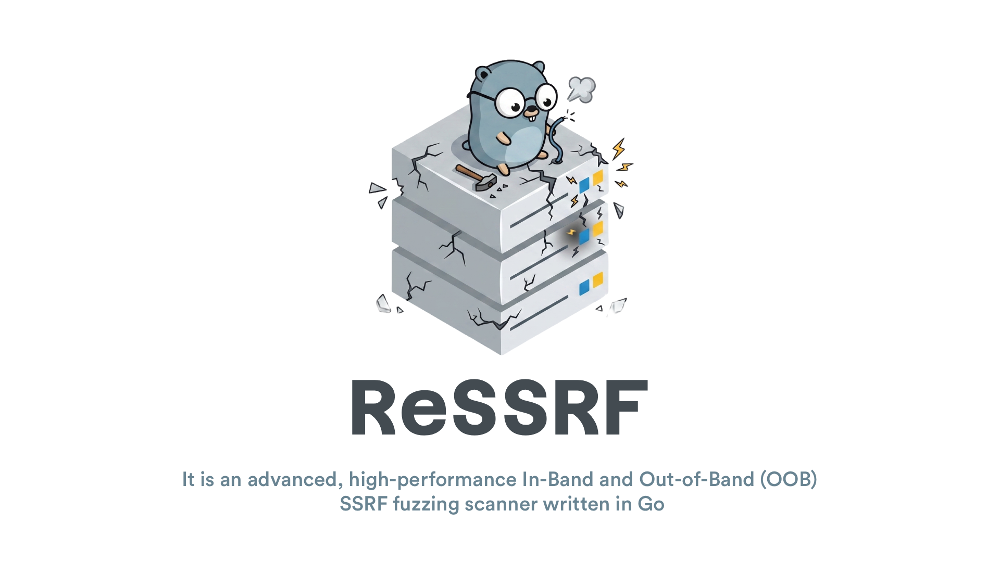

<p align="center">
  <a href="#features">Features</a> •
  <a href="#detection-workflow">Workflow</a> •
  <a href="#installation">Installation</a> •
  <a href="#usage">Usage</a> •
  <a href="#custom-payloads">Payloads</a> •
  <a href="#-contributing">Contribution</a> •
  <a href="#credits">Credits</a>
</p>

It automates server-side request forgery discovery across extensive URL targets by systematically mutating parameters and headers while maintaining real-time, dynamic correlation tracking over remote OAST collaboration protocols.

## Background

The detection logic, fuzzer coverage, and multi-phase structural workflows implemented in this engine are adapted and inspired by the SSRF module found in [**ReconFTW**](https://github.com/six2dez/reconftw). While the original scripting approach remains highly effective, **ReSSRF** was developed to translate those core behavioral primitives into a highly concurrent, compiled Go architecture—enhancing runtime memory optimization, scaling throughput capacity, and providing robust error tolerance during massive security engagements.

## Features

* **Multi-Vector Analysis:** Automates targeted parameter fuzzer passes alongside layered HTTP request header mutations.<br/>
* **Dynamic Callback Mapping:** Utilizes asymmetric cryptographic tokens (`interactsh`) to pinpoint precisely which parameter or header key triggered a remote network ping.<br/>
* **Advanced Protocol Bypasses:** Includes multi-cloud IMDS metadata tokens, alternative protocol wrappers (`gopher://`, `dict://`, `file://`), and character-obfuscated URL parser bypasses.

## Detection Workflow

```mermaid
graph TD
    %% Define Global Styles & Colors
    classDef target fill:#1a1c1e,stroke:#30363d,stroke-width:2px,color:#fff;
    classDef engine fill:#1f242c,stroke:#ffbc00,stroke-width:2px,color:#fff;
    classDef success fill:#1b2a1a,stroke:#2ea44f,stroke-width:2px,color:#fff;
    classDef alert fill:#341a1a,stroke:#da3637,stroke-width:2px,color:#fff;
    classDef platform fill:#161b22,stroke:#58a6ff,stroke-width:2px,color:#fff;

    %% Workflow Nodes
    T["🎯 Target:<br>https://vulnerable.server.tld"]:::target

    subgraph FuzzingEngine [" "]
        P1["1. Parameter Fuzzer"]
        P2["2. Header Fuzzer"]
        P3["3. Protocol Bypasses"]
    end
    style FuzzingEngine fill:#0d1117,stroke:#30363d,stroke-dasharray: 5 5

    IB["🔓 [ALT-PROTO HIT]<br>Local Content Leak"]:::success
    OAST["🌐 OAST Platform<br>(Public/Private)"]:::platform
    OOB["🔥 [LIVE OOB HIT]<br>Dynamic Callback Captured"]:::alert

    %% Connection Logic Routing
    T --> FuzzingEngine
    P3 -->|In-Band Reflection| IB
    P1 -->|Out-of-Bound Trigger| OAST
    P2 -->|Out-of-Bound Trigger| OAST
    OAST -->|Real-Time Polling Channel| OOB
```



1. **Phase 1 (Parameters):** Mutates query strings utilizing custom `idx` tracking subdomains mapped directly to internal request indices.
2. **Phase 2 (Headers):** Interrogates more than 35 classic routing and proxy-forwarding headers simultaneously under concurrent goroutines.
3. **Phase 3 (Alternative Protocols):** Tests local resource boundaries and checks response streams against system file reflection patterns to catch In-Band vulnerabilities immediately.

## Installation

```bash
go install github.com/R0X4R/ressrf@latest
```

Upon initial initialization, the tool automatically provisions its default multi-cloud wordlists inside `~/.config/ressrf/payloads.cfg`*

**Install from source**

```bash
git clone https://github.com/R0X4R/ressrf.git && cd ressrf && go install .
```

## Usage

```bash
ressrf -h
```

### Reference Flags

| Short Flag | Long Flag | Default | Description |
| --- | --- | --- | --- |
| **`-l`** | `--list` | *Required* | Input file path containing targeted URL matrices. |
| **`-c`** | `--collab` | *Dynamic* | Custom Interactsh/OAST infrastructure node domain override. |
| **`-t`** | `--threads` | `20` | Active concurrent system processing worker threads. |
| **`-r`** | `--rate` | `50` | Global maximum request rate constraint per second. |
| **`-H`** | `--header` | `""` | Append persistent structural authorization tokens or custom headers. |
| **`-o`** | `--outdir` | `vulns` | Output directory path for log captures and finding summaries. |
| **`-s`** | `--silent` | `false` | Suppress text banners, informational stats, and milestone lines. |
| **`-b`** | `--color-blind` | `false` | Strip ANSI terminal color sequences from stdout streams. |

### Operational Examples

Standard concurrent scan execution:

```bash
ressrf -l targets.txt -t 30 -r 100
```

Quiet fuzz execution routed to custom output storage destinations:

```bash
ressrf -l targets.txt -s -o ssrf_audit
```

## Custom Payloads

The underlying validation rules utilize embedded engine tracking. Default vectors located at `~/.config/ressrf/payloads.cfg` incorporate structural placeholder tags:

* `{COLLAB}`: Replaced dynamically with individual interactive tracker subdomains.
* `{COLLAB_URL}`: Pre-configured full HTTP connection tracking prefixes.

    ```text
    # Custom extensions are seamlessly appended at runtime
    [http://169.254.169.254/latest/meta-data/](http://169.254.169.254/latest/meta-data/)
    file:///etc/passwd
    dict://{COLLAB}:11211/stats
    [http://127.0.0.1.nip.io](http://127.0.0.1.nip.io).{COLLAB}
    ```

## Output Architecture

When an interactive callback hits the listener loop, results stream directly onto the terminal line in a concise format:

**Start the test server**

```bash
go test -v test.go
```

**Then test the tool**

```bash
./ressrf -l ssrf.txt

ReSSRF - Advanced In-Band and Out-of-Band SSRF Fuzzing Scanner with Dynamic Request Tracking

[LOADED 2 URLS] [COLLAB SESSION: subdomain.oast.pro]

http://localhost:8081/internal?file=http%3A%2F%2F127.0.0.1%3A80 [ALT-PROTO HIT] [Local Content Leak]
http://localhost:8081/internal?file=http%3A%2F%2Flocalhost%3A80 [ALT-PROTO HIT] [Local Content Leak]
http://localhost:8081/test?url=default [LIVE OOB HIT] [Header Injection] [Base-Url]
http://localhost:8081/test?url=default [LIVE OOB HIT] [Header Injection] [Referer]

[*] SCANNING COMPLETE. KEEPING SESSION OPEN 20s FOR REMAINING PAYLOADS TO LAND.

OOB CALLBACK RESULTS:
http://localhost:8081/test?url=default [LIVE OOB HIT] [Header Injection] [Base-Url]
http://localhost:8081/test?url=default [LIVE OOB HIT] [Header Injection] [Referer]

[TOTAL TRANSACTION HITS 233] [OUTPUT: /home/user/output]
```

**Generated Files**

The workspace output directory saves three core components:

1. `findings.txt` - Consolidated structural confirmations of vulnerabilities found.
2. `activity.log` - Chronological ledger tracking outbound requests, fuzzer mutations, and HTTP transport anomalies.
3. `callback.log` - Raw incoming transaction entries fetched securely from the OAST connection keys.

## 🤝 Contributing

I love PRs! Help me improve this tool with your knowledge, edge-case bypass techniques, and architectural ideas.

If you have discovered a unique SSRF bypass pattern, a custom cloud metadata endpoint mutation, or a trick to trigger unauthenticated network calls across trickier proxy structures, feel free to expand the workspace:

1. **Fork** the repository.
2. Update the embedded asset list at `pkg/payloads.cfg`.
3. Submit a **Pull Request** explaining your added vector logic.

Whether it is adding more powerful payloads, optimizing concurrent goroutine thread pooling, or polishing the terminal interface layout, all contributions are highly appreciated!

## Credits

* **SSRF Structural Methodology:** Heavily inspired by the fuzzer design patterns in **[reconftw](https://github.com/six2dez/reconftw)** by [@six2dez](https://github.com/six2dez).
* **Asymmetric OAST Infrastructure Engine:** Powered by ProjectDiscovery's [interactsh](https://github.com/projectdiscovery/interactsh).
